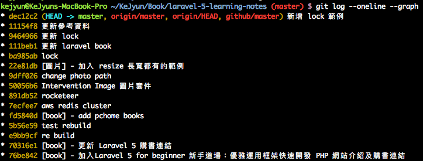
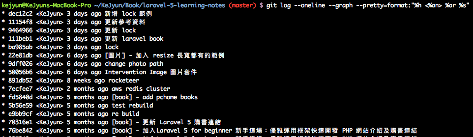
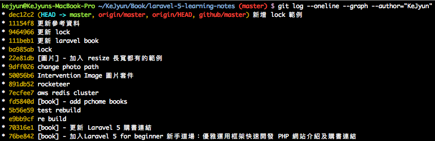
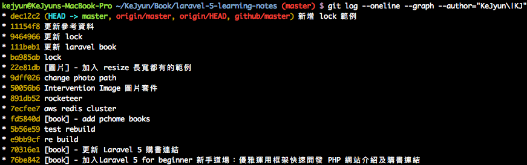
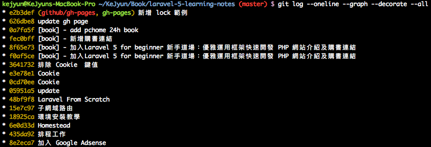
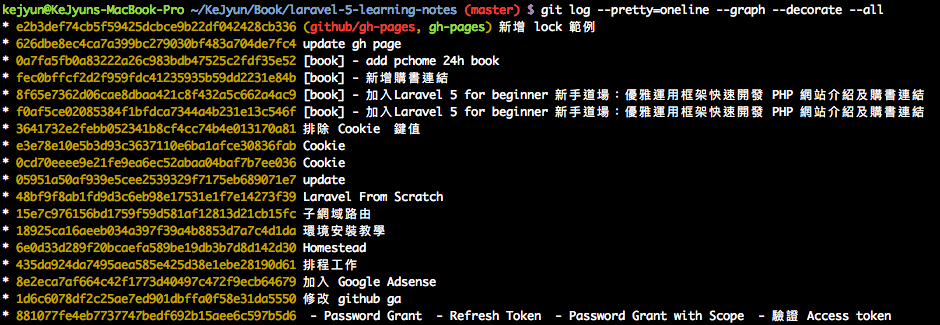

# 歷史

## 顯示目前圖形化 commit Log 紀錄

```shell
# 圖形化紀錄
git log --oneline --graph
```



```shell
# 包含時間資訊
git log --oneline --graph --pretty=format:"%h <%an> %ar %s"
```



```shell
# 找到指定作者 KeJyun 的 Log 紀錄
git log --oneline --graph --author="KeJyun"
```



```shell
# 找到指定作者 KeJyun 或 KJ 的 Log 紀錄
git log --oneline --graph --author="KeJyun\|KJ"
```



```shell
git log --oneline --graph --decorate --all
```




```shell
git log --pretty=oneline --graph --decorate --all
```




## 搜尋指定 commit 訊息的 Log 紀錄

```shell
git log --oneline --grep="文章"
```

## 參考資料
* [gitk - Viewing full version tree in git - Stack Overflow](https://stackoverflow.com/questions/5361019/viewing-full-version-tree-in-git)